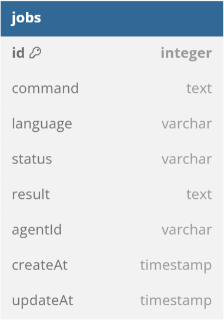

# Job Distribution

Xây dựng 1 ứng dụng dịch vụ phân phối job đáp ứng các yêu cầu sau:
1. Ứng dụng gồm 2 thành phần: Server và Agent. Trong 1 cụm ứng dụng yêu cầu có 1 server và có thể có 1 hoặc nhiều agent. 
2. Server chịu trách nhiệm quản lý job và phân phối.  Các thông tin lưu trữ tại sqlite3 database.
3. Agent nhận job và thực thi job. Agent có thể thực thi job được viết bởi bất kỳ ngôn ngữ nào. Có thể là Java, python, golang, nodejs.
4. Agent nối với server thông qua websocket. Xây dựng mô hình kết nối, các bản tin giao tiếp để server có thể quản lý các agent và đồng bộ thông tin giữa server và các agent. 
5. Ứng dụng server và agent viết bởi ngôn ngữ bạn muốn. Trên cùng 1 code base. Có thể triển khai dứoi dạng container hoặc cài đặt trực tiếp trên server. 
---
Yêu cầu:
1. Trình bày và mô tả kiến trúc giải pháp. 
2. Implement POC
3. Nêu và đánh giá các điểm tối ưu hoặc chưa tối ưu trong cách thức đã lựa chọn để implement.

## 1. Giải pháp
### Tổng quan


- Server: Quản lý job qua database, phân phối job đến các Agent
- Agent: Nhận job từ server, thực thi job, gửi kết quả đến Server
- Database: dùng sqlite3, một bảng jobs chịu trách nhiệm lưu trữ các job, gồm các trường dữ liệu như sau:



```
id: id của job
command: lệnh thực thi job
language: ngôn ngữ của job
status: trạng thái job pending/processing/completed
agentId: id của agent xử lý job này
creatAt: thời gian tạo job
updateAt: thời gian cập nhật job
```

### Luồng hoạt động
1. Khởi tạo kết nối:

Khi Agent khởi động, nó sẽ đăng ký với Server thông qua WebSocket bằng cách gửi thông điệp `registerAgent`.
Server duy trì một danh sách các Agent và trạng thái của chúng (free hoặc busy).

2. Tạo job:

Người dùng tạo một job thông qua giao diện người dùng.
Thông tin job bao gồm câu lệnh cần thực thi và ngôn ngữ lập trình được gửi tới Server qua thông điệp `createJob`.
Server lưu trữ job trong cơ sở dữ liệu và thêm job vào danh sách các job đang chờ xử lý.

3. Phân phối job:

Server tự động phân phối các job đang chờ xử lý cho các Agent rảnh rỗi qua thông điệp `distributeJob`.
Khi Agent nhận được job, nó chuyển sang trạng thái busy và bắt đầu thực thi job.

4. Thực thi job và cập nhật kết quả:

Agent thực thi job và gửi kết quả trở lại Server qua WebSocket thông điệp `updateJob`.
Server cập nhật trạng thái job trong cơ sở dữ liệu và chuyển job từ danh sách job đang xử lý sang danh sách job đã hoàn thành.
Agent chuyển trạng thái trở lại free và sẵn sàng nhận job mới.

5. Cập nhật giao diện người dùng:

Giao diện người dùng hiển thị danh sách job đang chờ xử lý, danh sách Agent và trạng thái của chúng, và danh sách job đã hoàn thành cùng với kết quả thực thi.
Các thay đổi trạng thái của job và agent được cập nhật theo thời gian thực thông qua WebSocket.


## 2. Implement
## Install and run
1. Môi trường:
- Node v18.8.0
- Npm v9.8.1
- Python 3.12.0
- Java 11.0.19
- Go

2. Chạy server
```sh
cd server
npm install
npm start
```

3. Chạy agent
```sh
cd agent
npm install
npm start
```

Mở http://localhost:3000/

## Demo


## 3. Đánh giá
### Ưu điểm
- Sử dụng WebSocket giúp cập nhật trạng thái job giữa Server và Agent được thực hiện tức thời
- Lưu trạng thái các Agent trên server, giúp xử lý nhanh hơn khi lưu trên database
- Mô hình đơn giản, dễ cài đặt

### Nhược điểm
- Xử lý job đồng bộ: nếu có nhiều job cần xử lý cùng lúc, server có thể bị quá tải -> dùng Message queue (Kafka) để quản lý và phân phối job hiệu quả
- Lưu trữ Job trên database: nhiều thao tác update trạng thái của job trên db -> chậm -> dùng Redis để cache lại trạng thái job sẽ và đang xử lý.
- Kết nối Websocket: kém ổn định -> dùng Kafka cho phân phối job, dùng API để update trạng thái job
- Chống lỗi: chưa có cơ chế chống lỗi nếu Agent hoặc Server bị lỗi -> dùng các cơ chế dự phòng và phân tải dữ liệu, dùng thêm database (MongoDB) để lưu log giúp giám sát và phát hiện sự cố.

### Cải tiến


1. Tạo job mới
- Nhận job và lưu thông tin job tạm thời vào Redis.
- Đẩy job vào một Kafka topic nhận các job mới.
2. Phân phối job
- Kafka nhận job từ Server và lưu vào topic.
- Các Agent đăng ký tiêu thụ job từ Kafka sẽ được thông báo job mới.
3. Xử lý job
- Agent lấy job từ Kafka topic và cập nhật trạng thái đang xử lý job.
- Agent thực thi job.
4. Cập nhật trạng thái job
- Server nhận kết quả từ Agent.
- Server cập nhật trạng thái job và Agent trong Redis.
- Server lưu log vào MongoDB.
